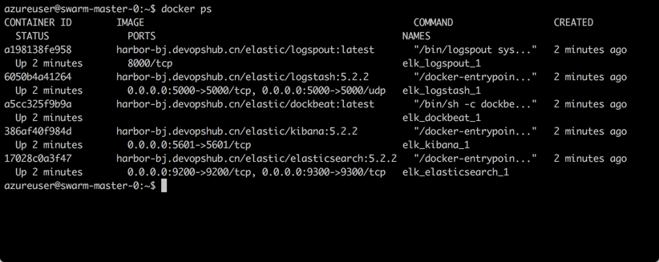

本实例中使用ELK最新版本5.2.2 搭配dockbeat以及logspout用来分别收集docker host环境信息，以及应用信息，并介绍如何使用Kibana对数据进行整理以及展示。

<h3>第一步 - 在需要运行ELK Host主机上修改虚拟内存。</h3>

由于在linux系统上，elasticsearch默认使用hybrid mmapfs / niofs来存储索引文件，因此操作系统默认会限制mmap，所以可能会导致内存溢出的问题，所以我们可以通过以下设置来增加mmap限制。

    nano /etc/sysctl.conf 

添加配置：vm.max_map_count=262144，ctrl+x 保存退出

<h3>第二步 - 克隆当前代码到docker主机。</h3>

    git clone https://github.com/lean-soft/elk.git

<h3>第三步 - 通过Compose运行ELK以及对应组件。</h3>
<table>
		<tr>
		<td>
		组件名称
		</td>
		<td>官方说明</td>
		</tr>
    <tr>
        <td>Kibana</td>
        <td>Kibana gives shape to your data and is the extensible user interface for configuring and managing all aspects of the Elastic Stack.</td>
       <tr>
        <td>Elastic Search</td>
        <td>Elasticsearch is a distributed, JSON-based search and analytics engine designed for horizontal scalability, maximum reliability, and easy management.</td>
    </tr>
     <tr>
        <td>Logstash</td>
        <td>Logstash is a dynamic data collection pipeline with an extensible plugin ecosystem and strong Elasticsearch synergy.
        </td>
    </tr>
     <tr>
        <td>Logspout</td>
        <td>Logspout is a log router for Docker containers that runs inside Docker. It attaches to all containers on a host, then routes their logs wherever you want. It also has an extensible module system.</td>
    </tr>
    <tr>
        <td>Dockbeat</td>
        <td>Beats is a platform for lightweight shippers that send data from edge machines to Logstash and Elasticsearch.</td>
    </tr>
</table>

进入代码根目录

    cd elk

运行ELK所有组建：

    docker-compose up -d
    
查看Containers运行状态

    docker ps

<h3>第四步 - 打开kibana进入管理配置界面</h3>

打开浏览器,输入http://ip:5601

<h3>第五步 - 配置logstash索引</h3>

 1. 点击Manaement -> Index Patterns -> Add New 
 2. 输入logstash-* 
 3. Time-field name选择 @timestamp 
 4. 点击create

<h3>第六步 - 配置dockbeat索引</h3>

 1. 点击Manaement -> Index Patterns -> Add New 
 2. 输入dockbeat-* 
 3. Time-field name选择@timestamp 
 4. 点击create

<h3>第七步 - 查看数据</h3>
点击Discover查看数据

<h3>第八步 - 将logstash以及dockbeat部署到更多需要被监控的节点中（Docker主机）</h3>
运行logspout收集容器日志。
<table><tr><td>IP Address</td><td>Logstash服务器IP地址，通过5000端口发送docker主机信息到Logstash</td></tr>
</table>

    docker run -d --name="logspout"
    --volume=/var/run/docker.sock:/var/run/docker.sock harbor-bj.devopshub.cn/elastic/logspout:latest syslog://[IP Address]:5000

运行dockbeat收集服务器性能数据。
<table><tr><td>DockerHostName</td><td>当前被监控主机的显示名称，可以通过在主机上运行hostname命令来获取。</td></tr>
</table>

    docker run -d --hostname [DockerHostName]--name dockerbeat --volume=$PWD/dockerfiles/dockbeat/dockbeat.yml:/etc/dockbeat/dockbeat.yml --volume=/var/run/docker.sock:/var/run/docker.sock harbor-bj.devopshub.cn/elastic/dockbeat:latest

<h3>第九步 - 通过kibana查看其他Dcoker Host数据数据是否已经收集到</h3>

<h3>第十步 - 通过kikana配置图表</h3>

<h3>第十一步 - 配置仪表盘</h3>

